# РАЗРАБОТКА КОНФИГУРАЦИИ НА 1С

## Оглавление

1. [Глава I](#глава-i) \
 1.1. [Техническое задание.](#техническое-задание) \
 1.2. [Диграмма переменных.](#диаграмма-переменных) \
 1.3. [Схема связей пользователей](#схема-связей-пользователей)  
2. [Глава II](#глава-ii) \
 2.1. [Создание переменных перечисления](#создание-переменных-перечисления)\
 2.2. [Создание справочника](#создание-справочника)\
 2.3. [Создание формы элемента и модуля](#создание-формы-элемента-и-модуля)
3. [Глава III](#глава-iii)

<!-- 
4. [Chapter IV](#chapter-iv) \
 4.1. [Quest 2. Checking Module.](#quest-2-checking-module) 
5. [Chapter V](#chapter-v) \
 5.1. [List 2.](#list-2) \
 5.2. [List 3.](#list-3) \
 5.3. [List 4.](#list-4) 
6. [Chapter VI](#chapter-vi) \
 6.1. [Quest 3. BST.](#quest-3-bst) \
 6.2. [Quest 4. Growing tree.](#quest-4-growing-tree) \
 6.3. [Quest 5. Three styles of traversing.](#quest-5-three-styles-of-traversing)
7. [Chapter VII](#chapter-vii) --> 

# Глава I

## Техническое задание.

    В функционале необходимо учесть:
        1. Выводы документов для проведения мероприятий;
        2. Выводы документов благодарностей;
        3. Список занятых аудиторий;
        4. Планирование мероприятий;
        5. Учет потребностей для проведения мероприятия;
        6. Рейтинг активности мероприятий;
        7. Рейтинг активности участников;
        8. Автоматизированное распределение по клубам.
        9. НА ПОДУМАТЬ(хранение ключей)

## Диграмма переменных.

<!-- описание -->
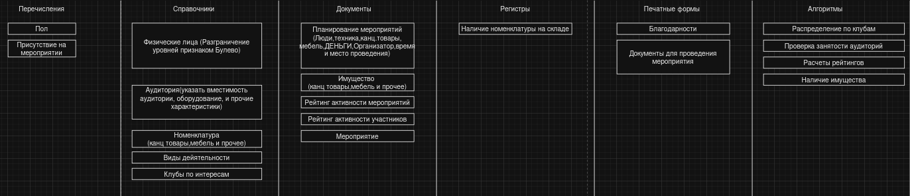

## Схема связей пользователей.

<!-- описание -->
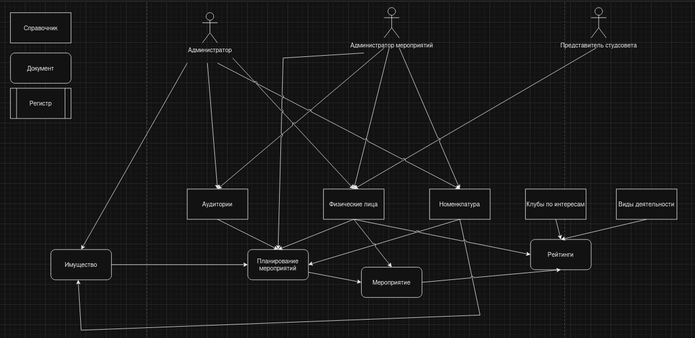

# Глава II

## Создание переменных перечисления.

    1. Открыть конфигуратор
    2. В панели конфигуратора нажать правой кнопкой мышки на "Перечисление"
    3. Нажать "добавить" 
    4. В окне можно изменить поле "имя" во вкладке "Основные" 
    5. Во вкладке "Данные" можно добавить неограниченное кол. значение, из которых пользователи будут выбирать
    6. Таким образом мы сделали объекты "пол" и "ПрисутствиеНаМероприятии"

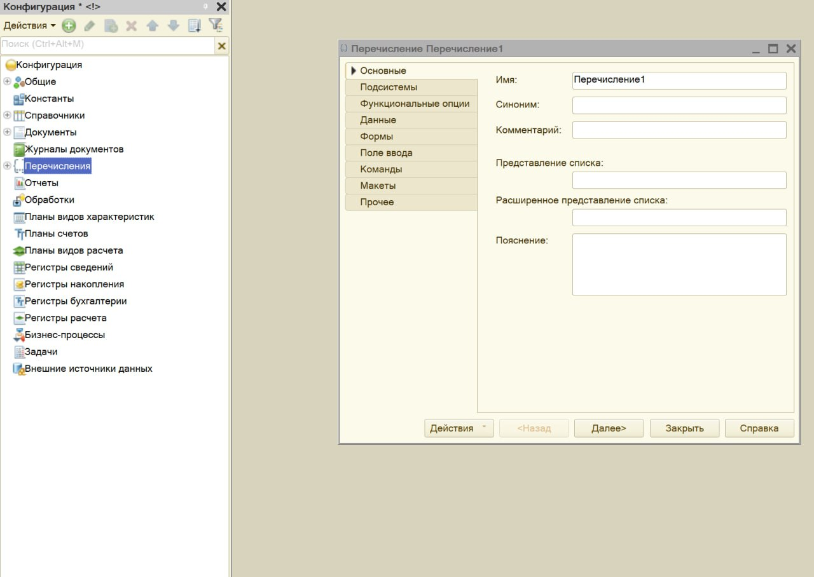
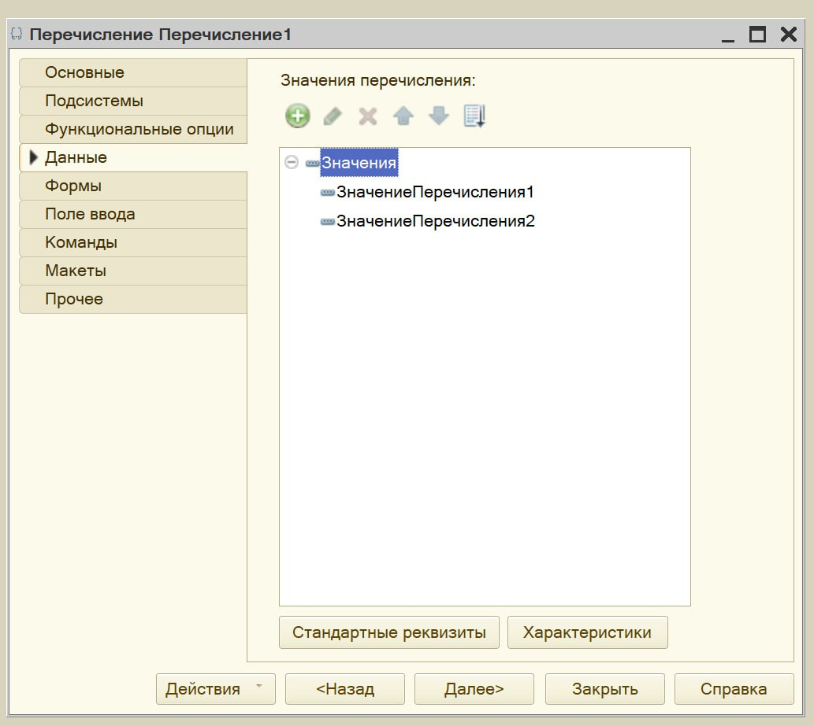

## Создание справочника.
     
    1. В панели конфигуратора нажать правой кнопкой мышки на "Справочники"
    2. Нажать "добавить" 
    3. В окне можно изменить поле "имя" во вкладке "Основные" 
    4. Во вкладке "Данные" можно добавить реквизиты такие как "Фамилия" итд...
    5. Для добавление объектов перечислений, в свойстве реквизита в графе тип нужно найти ссылку на нужный объект

\> *Примечание:*\
        -В свойстве реквизита в графе "тип" нужно менять тип переменной. Например, строка , число итд.\
        -Для такого реквизита как телефон используется маска, ее можно найти в свойстве реквизита в разделе представление есть маска, для телефона используется маска +7(999) 999-99-99
        -Также в разделе представление для полей "фамилия" и "имя" выставленно "Проверка заполнения" "Выдавать ошибку" для того чтоб пользователи не могли не запонить эти поля

### Окно справочника
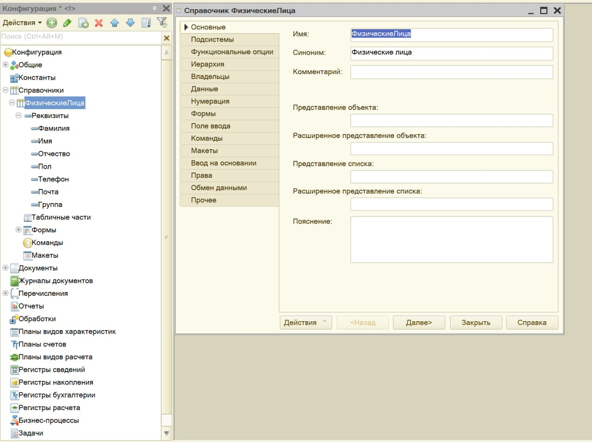

### Реквизиты справочника
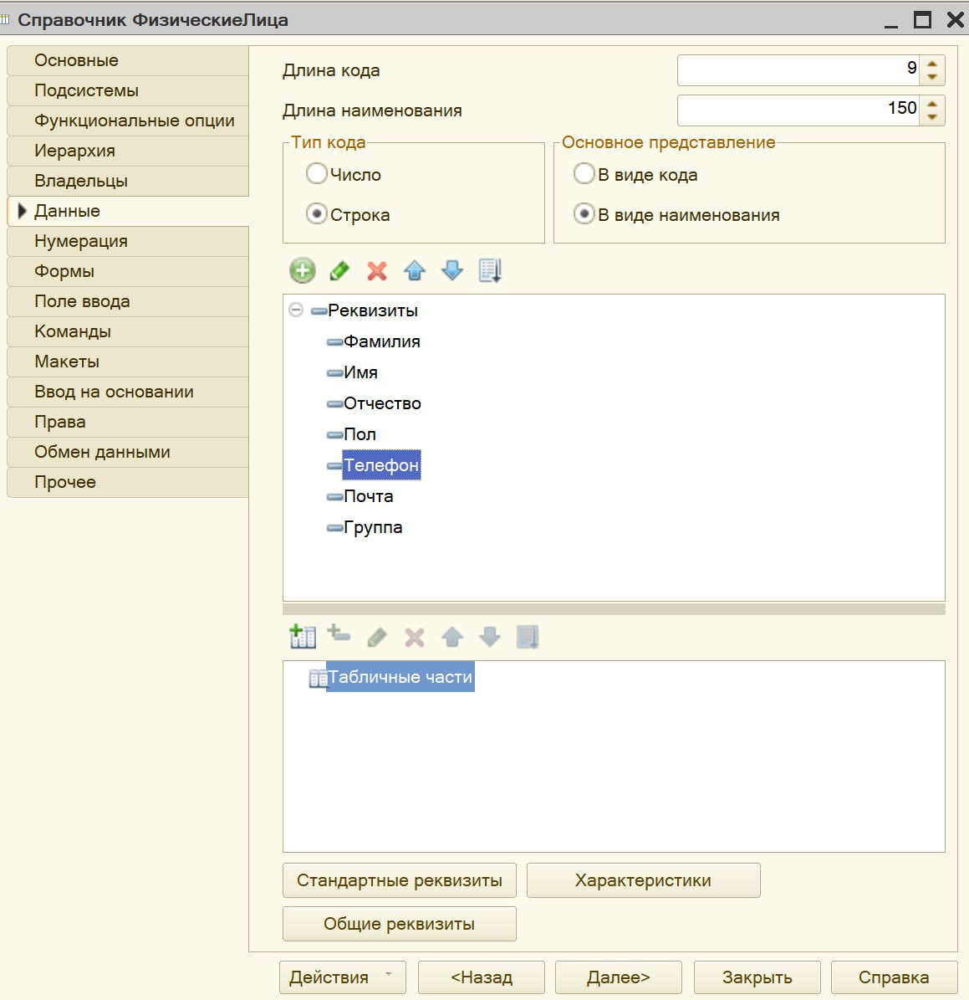

### Свойства реквизита
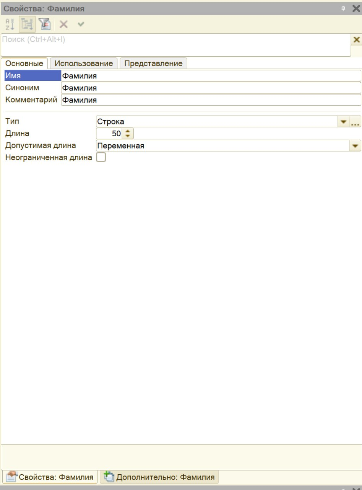

### Выбор типа объекта
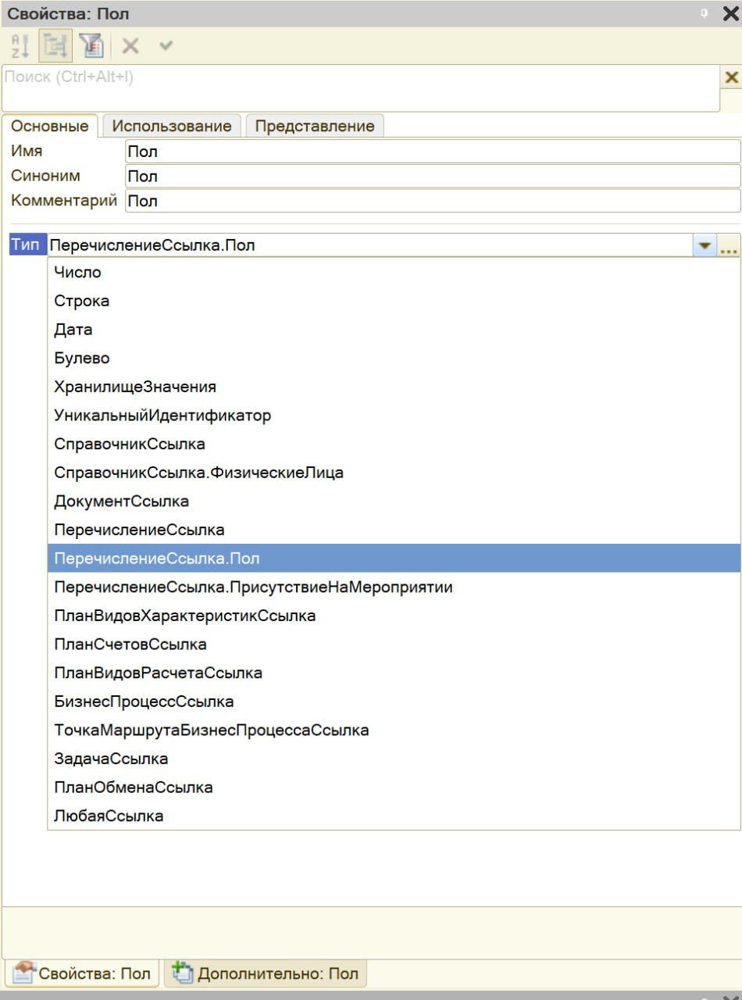

## Создание формы элемента и модуля.

### Вкладка форма в справочнике
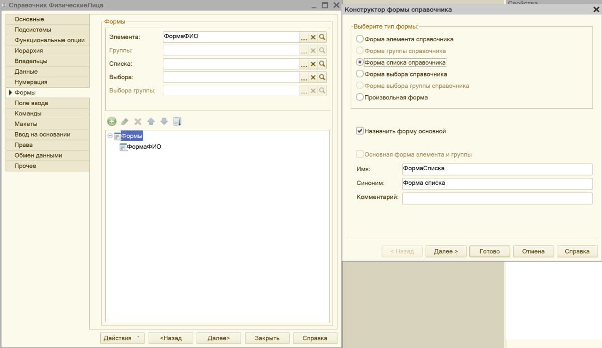

### Конфигуратор формы и группировка реквизитор
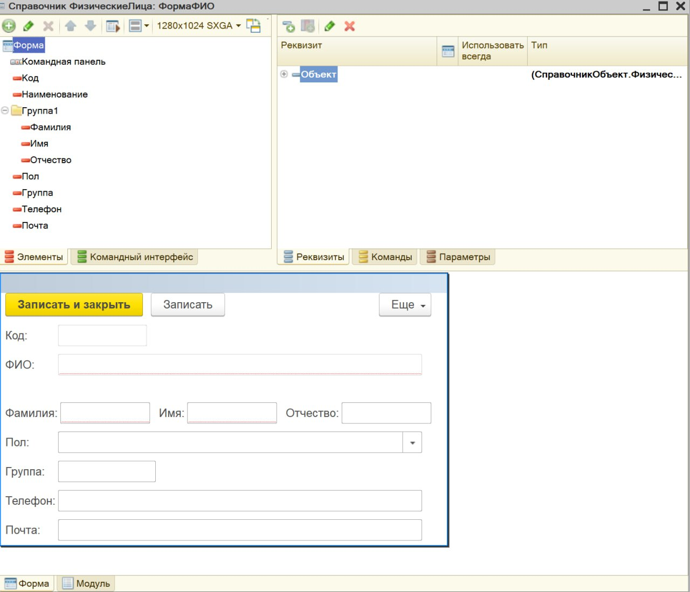

### Свойство группы
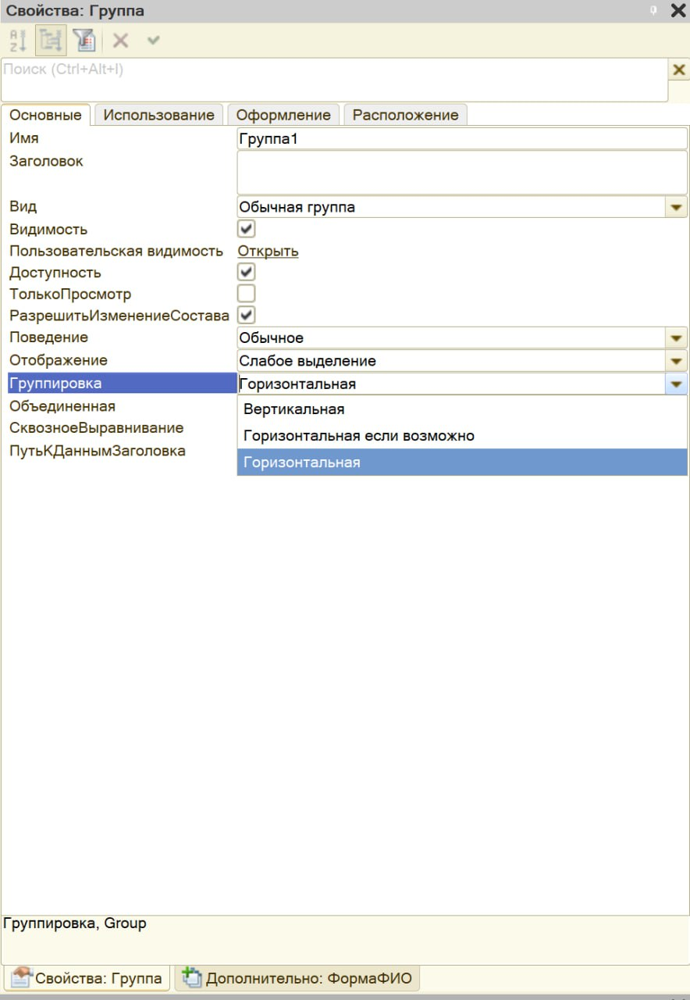

### Создание события "ПриИзменении"

    1. В свойстве "поле" во вкладке "События" нужно нажать на "лупу"
    2. В открытой вкладке "модуля" нужно написать код
    3. Код должен автоматически заполнять поле "ФИО" беря данные из поле "Фамилия", "Имя", "Отчество"

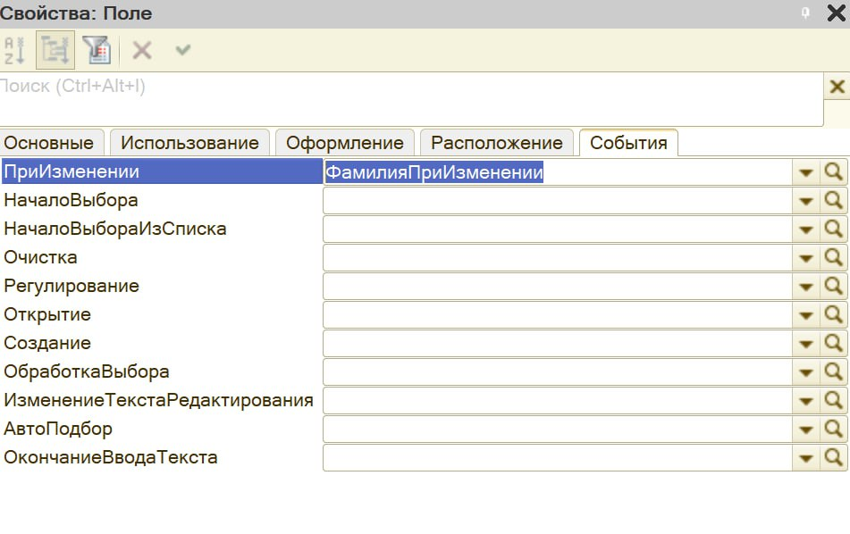
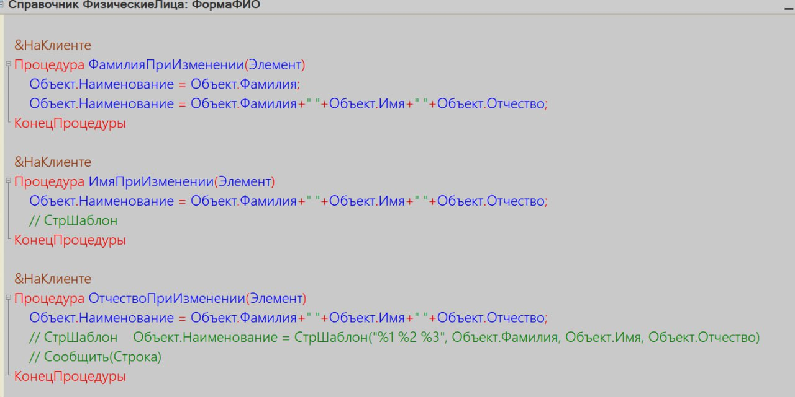

# Глава III